# Backlog Dependency Graph

## Reading the graph

- `A --> B` means issue A must complete before issue B can complete safely.
- Decision gates are not implementation issues. They use the identifiers from `OPEN_QUESTIONS.md` and block the connected issue until BA/Technical Lead/Database Owner/Payment Owner records an answer.
- The graph reflects the fixed app direction: Accounts and Operations feed Bookings; Bookings feeds Payments; Integration consumes all domains.

## Critical-path overview

```mermaid
flowchart LR
    DB01[DB-01 Governance] --> OPS01[OPS-01 Station]
    DB01 --> OPS03[OPS-03 Bus]
    OPS01 --> OPS02[OPS-02 Route]
    OPS03 --> OPS04[OPS-04 BusSeat]
    OPS02 --> OPS08[OPS-08 Trip]
    OPS03 --> OPS08
    OPS08 --> OPS10[OPS-10 Bus conflicts]
    OPS08 --> OPS11[OPS-11 Assignment]
    OPS10 --> OPS12[OPS-12 Staff overlap]
    OPS11 --> OPS12
    OPS04 --> DB03[DB-03 Operations review]
    OPS08 --> DB03
    OPS12 --> DB03
    OPS04 --> BKG01[BKG-01 Freeze contract]
    OPS08 --> BKG01
    BKG01 --> BKG05[BKG-05 Booking schema]
    DB03 --> BKG05
    BKG05 --> DB04[DB-04 Booking review]
    DB04 --> BKG06[BKG-06 Booking service]
    BKG06 --> BKG07[BKG-07 Double booking]
    DB04 --> PAY05[PAY-05 Payment contract]
    PAY05 --> PAY06[PAY-06 Payment schema]
    BKG06 --> INT01[INT-01 Booking-Payment integration]
    PAY06 --> INT01
    INT01 --> PAY07[PAY-07 Payment intent]
    PAY07 --> PAY10[PAY-10 Matching]
    PAY10 --> PAY08[PAY-08 Webhook flow]
    PAY04[PAY-04 Payload parser] --> PAY09[PAY-09 Idempotency]
    PAY09 --> PAY08
    PAY08 --> PAY14[PAY-14 Payment tests]
    BKG07 --> BKG12[BKG-12 Booking tests]
    DB03 --> OPS07[OPS-07 Operations tests]
    PAY14 --> INT02[INT-02 Happy path]
    BKG12 --> INT02
    OPS07 --> INT02
    ACC07[ACC-07 Accounts tests] --> INT02
```

The end-to-end critical path is therefore:

`DB-01 → Operations schema/locking → DB-03 → BKG-01 → BKG-05 → DB-04 → BKG-06/BKG-07 → PAY-05 → PAY-06 → INT-01 → PAY-07/PAY-10/PAY-08 → PAY-14 → INT-02`.

Open-decision gates on that path—especially DB-01, DB-02, DB-04, DB-05, DB-06, DB-07, DB-08 and API-06 through API-11—must be resolved early even when their implementation issue belongs to a later sprint.

## Issue-to-issue blocking edges

### Accounts edges

- ACC-01 supports ACC-02 and ACC-04 and is required by ACC-07.
- ACC-03 blocks completion of ACC-02, ACC-06, OPS-05/OPS-06, BKG-09/BKG-10/BKG-11, PAY-12/PAY-13 and INT-04.
- ACC-04 blocks ACC-05.
- ACC-02, ACC-03, ACC-04, ACC-05 and ACC-06 block ACC-07.
- ACC-06 and the existing Employee model provide the employee contract consumed by OPS-11/OPS-12; full deactivation integration waits for DB-09.

### Operations edges

- OPS-01 blocks OPS-02.
- OPS-02 and OPS-03 block OPS-08.
- OPS-03 blocks OPS-04.
- OPS-08 blocks OPS-09, OPS-10 and OPS-11.
- OPS-10 and OPS-11 block OPS-12.
- OPS-01–OPS-04 plus OPS-08–OPS-12 block full OPS-05 completion.
- OPS-05 and approved API decisions block OPS-06.
- OPS-01–OPS-06 plus OPS-08–OPS-12 block OPS-07.
- OPS-04 and OPS-08 block BKG-01, BKG-03/BKG-04 and BKG-05.
- DB-03 approval of stabilized Operations migrations blocks BKG-05.

### Bookings edges

- BKG-01 blocks BKG-05.
- BKG-05 blocks BKG-03, BKG-04 and BKG-06–BKG-12, plus PAY-05/PAY-13 and INT-01.
- BKG-03 and BKG-04 support BKG-06 and block the complete BKG-11 API surface.
- BKG-06 blocks BKG-07, BKG-08, PAY-07 and INT-01.
- BKG-05/BKG-06 plus INT-01 block final BKG-08/BKG-09 behavior with pending Payments.
- BKG-05 plus OPS-09 and the API-04 decision block BKG-10.
- BKG-03–BKG-10 block BKG-11.
- BKG-03–BKG-11 plus DB-04 block BKG-12.
- BKG-12 blocks INT-02 and INT-03.
- BKG-02 does not block implementation; it is an immediately actionable test-design input to BKG-06–BKG-12.

### Database edges

- DB-01 governs every schema issue: OPS-01–OPS-04, OPS-08/OPS-11, BKG-05 and PAY-06.
- DB-01 blocks DB-02.
- Completed Operations migrations and their concurrency decisions block DB-03.
- DB-03 blocks BKG-05 because Bookings requires stable Trip/BusSeat contracts.
- BKG-01/BKG-05 and DB-03 block DB-04.
- DB-04 blocks PAY-05/PAY-06 and final BKG schema merge.

### Payments edges

- PAY-01 blocks PAY-02 and PAY-03.
- PAY-02 blocks PAY-04 and PAY-08.
- PAY-03 blocks PAY-07.
- PAY-04 blocks PAY-05, PAY-09 and PAY-10.
- BKG-05 plus DB-04 block PAY-05; PAY-05 blocks PAY-06.
- PAY-06 blocks PAY-07, PAY-09, PAY-10, PAY-11, PAY-13 and INT-01.
- INT-01 plus PAY-03/PAY-06 and BKG-06 block PAY-07.
- PAY-07 blocks PAY-10.
- PAY-09 and PAY-10 block PAY-08.
- PAY-10 blocks PAY-11; PAY-11 blocks PAY-12.
- PAY-01–PAY-13 plus INT-01 block PAY-14.
- PAY-14 blocks INT-02 and INT-03.

### Integration edges

- BKG-05/BKG-06/BKG-08/BKG-09 and PAY-05/PAY-06 block INT-01.
- ACC-07, OPS-07, BKG-12, PAY-14 and INT-01 block INT-02.
- OPS-07, BKG-12, PAY-14 and INT-01 block INT-03.
- ACC-03/ACC-07, OPS-06, BKG-11 and PAY-08/PAY-12/PAY-13 block INT-04.
- Stable migrations across all four domains plus the approved INT-02 scenario block INT-05.

## Decision gates

- **API-01:** blocks ACC-06 and OPS-06; consequently blocks ACC-07, OPS-07 and INT-04.
- **API-02:** blocks OPS-09/OPS-06; consequently blocks OPS-07 and downstream Trip-state integration.
- **DB-01 (open question):** blocks BKG-01/BKG-05/DB-04 via the composite Ticket→Booking/Trip FK strategy.
- **DB-02 (open question):** blocks BKG-01/BKG-05/BKG-07/DB-04 via generated `active_seat_key` strategy.
- **DB-04 (open question):** blocks OPS-10/OPS-12/DB-03 via concurrency enforcement depth.
- **DB-05:** blocks BKG-01/BKG-06/BKG-08 via near-departure booking cutoff/expiry.
- **DB-06:** blocks OPS-05/OPS-09, BKG-01/BKG-05 and INT-01 via DB state-transition enforcement depth.
- **DB-07:** blocks PAY-05/PAY-08/PAY-10/PAY-11 via `REVIEW_REQUIRED` mapping.
- **DB-08:** blocks PAY-05/PAY-06/PAY-12 via transaction mutability.
- **DB-09:** blocks ACC-06, OPS-05/OPS-12 and full deactivation behavior.
- **API-03:** blocks implementation of Booking `COMPLETED`; the current backlog does not silently add that transition to another issue.
- **API-04:** blocks BKG-10/BKG-11/BKG-12.
- **API-05:** blocks BKG-09/BKG-11/BKG-12 and INT-04.
- **API-06:** blocks PAY-07/PAY-14.
- **API-07:** blocks PAY-05/PAY-07/INT-01/PAY-14.
- **API-08:** blocks PAY-02/PAY-04/PAY-08/PAY-09/PAY-10/PAY-14 and INT-03.
- **API-09:** blocks PAY-13/PAY-14/INT-04.
- **API-10:** blocks PAY-11/PAY-12/PAY-14.
- **API-11:** blocks PAY-05/PAY-08/PAY-12/PAY-14.
- **API-12:** blocks INT-05.

## Work that can run in parallel now

The eight immediately actionable issues form independent lanes:

- Accounts: ACC-01 and ACC-03 can proceed; ACC-04 remains blocked until verified-email/inactive-user behavior is approved.
- Operations: OPS-01 and OPS-03 can be implemented on separate branches only if `vgh203` avoids competing `operations` migrations; preferred merge order is OPS-01 then OPS-03.
- Bookings: BKG-02 can prepare traceable scenarios without importing or creating upstream models.
- Lead/Database: DB-01, followed by DB-02.
- Lead/Payments: PAY-01 can freeze environment naming without creating Payment persistence.

Decision-resolution work for ACC-04/ACC-05, BKG-01, PAY-02–PAY-05 and API/DB gates should also start during Sprint 1, but the corresponding implementation issues remain `BLOCKED` until decisions are recorded.

## Work that should not begin yet

- Do not implement OPS-02/OPS-04/OPS-08–OPS-12 until their upstream Operations model and decision dependencies are satisfied.
- Do not implement full Operations services/APIs/tests (OPS-05–OPS-07) until model contracts and API-01/API-02/DB-06/DB-09 are approved.
- Do not create Booking/Ticket models (BKG-05) before stable Trip/BusSeat contracts, DB-03 review and BKG-01 decisions.
- Do not implement Booking workflows/APIs (BKG-03–BKG-12) before BKG-05 and their specific API/DB gates.
- Do not create Payment persistence (PAY-05/PAY-06) before Booking exists and DB-04 approves its migrations.
- Do not implement the webhook business flow (PAY-08–PAY-12) before verified SePay fixtures/contracts and Payment persistence exist.
- Do not begin final integration/demo issues (INT-01–INT-05) before their domain prerequisites; in particular, do not use seed data to hide missing migrations.
